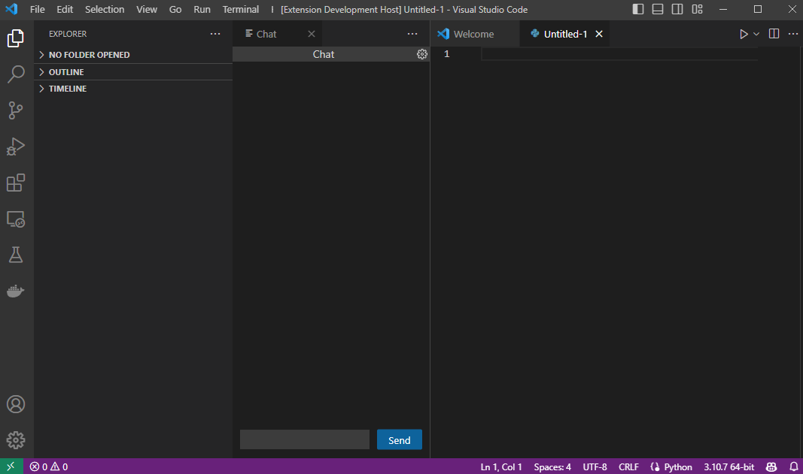
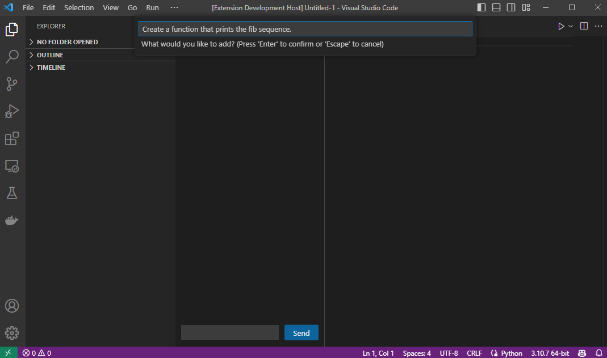
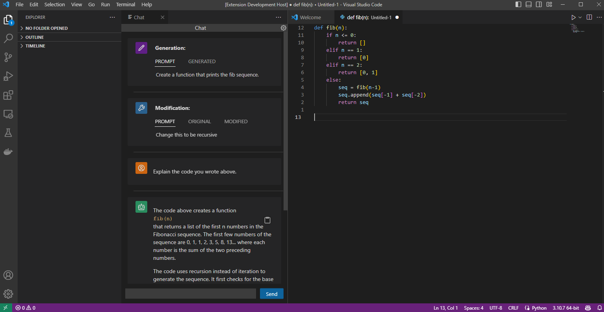

# You Say I Code Extension

This is an extension that integrates GPT-3 with VSCode. It features tool to help you write and refactor code, as well as a chat tool to converse with an AI assistant.

## Features
These are Command Palette commands, which you can bind to whatever key you want!
1. Generate Code:
    - Write a prompt, and the extension will insert code fulfilling it at your cursor location.
2. Modify Code:
    - With some code selected, tell the extension how you want to change the code.
3. Open Chat View:
    - Open a chat view where you can talk with an AI assistant.

## Screenshots

## Requirements

You will need an OpenAI token to be able to generate AI responses. Set your API token in the settings for this extension.

## Todo
There is still a lot of things that could improve about this extension.
- The chat view should ideally sent the message upon clicking enter instead of having the press the button every time.
- The goto command, which jumps to a place in your code based on a description of it.

I will try to implement these as time goes on, but if you would like to contribute, feel free to make a pull request.

## Contributing
If you would like to add any new features you have thought of, they are welcome! Just submit a pull request!